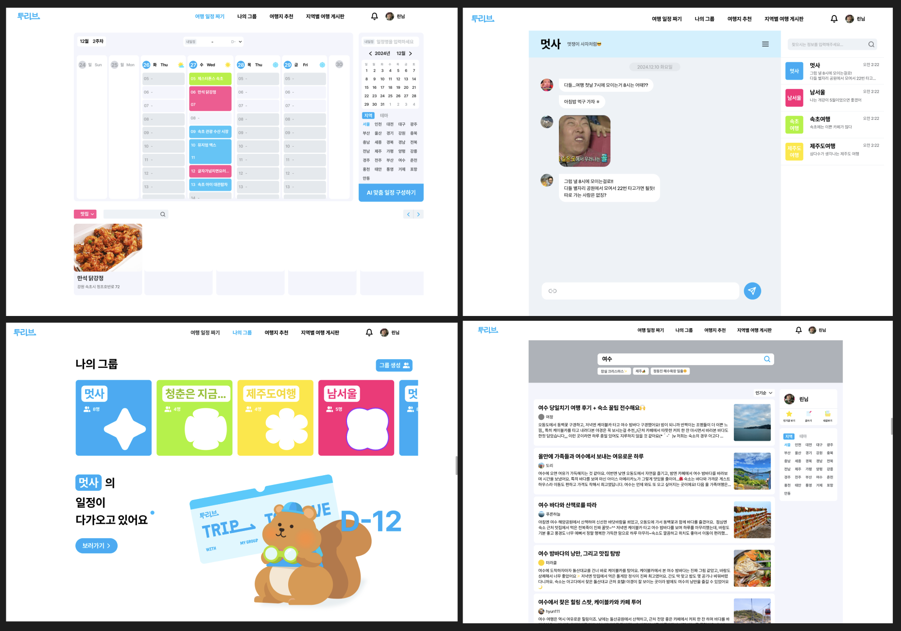

<div align="center">

# 투리브(Toleave)


> ### 여행 그룹 관리 · 일정 계획 · 실시간 소통을 담은 여행 동행 서비스

<!-- 운영 도메인 / 서비스 바로가기 배지 자리 -->
서비스 URL: https://toleave.cloud

Frontend Repo: https://github.com/likeliontravel/FE
</div>

<br>

## 📖 Introduction

<!-- toleave가 무엇인지 + 핵심 기능(여행 그룹 · 일정 · 장소 추천) -->


- 그룹 별 완성하는 여행 계획표
- 실시간 소통을 돕는 그룹 채팅
- 그룹 단위로 일정을 계획 & 공유
- 지역 및 테마 별 핫플 관광지 & 식당 & 숙소를 공유하는 여행 게시판

<br>

## 🛠 Tech Stack

### Backend


### Auth


### Database & Storage


### Test


### Monitoring


### Infra & CI/CD


### External API


### Co-Work


<br>

## 🏗 System Architecture

### 배포 서버 Architecture


<br>

## 🗂 ERD


<br>

## 📡 API Reference

###  [Notion API 명세](https://app.notion.com/p/145a05c99aca80c6a70cf5f6ea41dc99?v=145a05c99aca8105b428000ca295709d)

<br>

## ⚙️ Core Design & Implementation

<details>

<summary><strong>WebSocket + STOMP 실시간 채팅</strong></summary>

</details>

<details>

<summary><strong>flyway 도입과 DB 마이그레이션</strong></summary>

</details>

<details>

<summary><strong>k6 테스트 & 모니터링 도입</strong></summary>

</details>

## 🧯 Troubleshooting Archive

<!-- 개발 중 겪은 주요 기술 과제와 해결 과정 정리/링크 -->

<details>

<summary><strong>여행지 필터링 조회 API 응답시간 개선</strong></summary>

### 문제 상황

문제상황 예시

### 원인 분석 과정

### 1. ㅡㅡㅡ

### 2. ㅡㅡㅡ

### 해결 방안

### 1. ㅡㅡㅡ

### 2. ㅡㅡㅡ

### 3. ㅡㅡㅡ

</details>


<details>

<summary><strong>,,,</strong></summary>

### 문제 상황

문제상황 예시

### 원인 분석 과정

### 1. ㅡㅡㅡ

### 2. ㅡㅡㅡ

### 해결 방안

### 1. ㅡㅡㅡ

### 2. ㅡㅡㅡ

### 3. ㅡㅡㅡ

</details>

<br>

## 👥 Members

<!-- 프로필 사진 · 이름 · GitHub 링크 표 -->

<table align="center">
  <tr>
    <td align="center" width="160">
      <a href="https://www.behance.net/59540b0d">
        
        <br />
        <strong>안혜린</strong>
      </a>
      <br />
      <sub>Design</sub>
    </td>
    <td align="center" width="160">
      <a href="https://github.com/jwj9127">
        
        <br />
        <strong>jwj9127</strong>
      </a>
      <br />
      <sub>Frontend</sub>
    </td>
    <td align="center" width="160">
      <a href="https://github.com/sitduk143">
        
        <br />
        <strong>sitduk143</strong>
      </a>
      <br />
      <sub>Frontend</sub>
    </td>
  </tr>
</table>

<table align="center">
  <tr>
    <td align="center" width="160">
      <a href="https://github.com/JeongBuBu">
        
        <br />
        <strong>JeongBuBu</strong>
      </a>
      <br />
      <sub>Backend</sub>
    </td>
    <td align="center" width="160">
      <a href="https://github.com/yeboong99">
        
        <br />
        <strong>Yeboong99</strong>
      </a>
      <br />
      <sub>Backend</sub>
    </td>
    <td align="center" width="160">
      <a href="https://github.com/jjuchan">
        
        <br />
        <strong>jjuchan</strong>
      </a>
      <br />
      <sub>Backend</sub>
    </td>
    <td align="center" width="160">
      <a href="https://github.com/ANMNYG">
        
        <br />
        <strong>ANMNYG</strong>
      </a>
      <br />
      <sub>Backend</sub>
    </td>
  </tr>
</table>

<br>
<br>

<!-- 7. Getting Started ────────────────────────── -->

<details>

<summary>
<h2 style="display: inline;"> 🚀 Getting Started</h2>
</summary>

### Environment Variables

<!-- .env.default → .env 복사 후 설정할 값 안내 -->

```bash
# ===================================
# Toleave 프로젝트 환경 변수 기본 샘플 (.env.default)
# 실제 값은 넣지 말고 각자 환경에서 덮어쓰기
# ===================================

# ==============================
# Database (mySQL)
# ==============================
DB_URL=NEED_TO_SET

# 로컬 앱 수동실행용 username, password
DB_USERNAME=NEED_TO_SET
DB_PASSWORD=NEED_TO_SET

# 최초 MYSQL 컨테이너 생성 시 초기화에 ROOT접속이 반드시 필요하기 때문에 root계정 비밀번호 있어야 함
MYSQL_ROOT_PASSWORD=TO_SET

# ==============================
# GCP
# ==============================
GCP_PROJECT_ID=NEED_TO_SET
GCP_CREDENTIALS_PATH=NEED_TO_SET

# ==============================
# JWT
# ==============================
JWT_SECRET=NEED_TO_SET

# ==============================
# Mail (Gmail SMTP)
# ==============================
MAIL_USERNAME=NEED_TO_SET
MAIL_PASSWORD=NEED_TO_SET
MAIL_HOST=smtp.gmail.com
MAIL_PORT=587

# ==============================
# OAuth2 - Google
# ==============================
GOOGLE_CLIENT_ID=NEED_TO_SET
GOOGLE_CLIENT_SECRET=NEED_TO_SET

# ==============================
# OAuth2 - Naver
# ==============================
NAVER_CLIENT_ID=NEED_TO_SET
NAVER_CLIENT_SECRET=NEED_TO_SET

# ==============================
# OAuth2 - Kakao
# ==============================
KAKAO_CLIENT_ID=NEED_TO_SET
KAKAO_CLIENT_SECRET=NEED_TO_SET

# ==============================
# API
# ==============================
API_URL=NEED_TO_SET
SERVICE_KEY=NEED_TO_SET

# ==============================
# GCS
# ==============================
GCS_BUCKET_TOLEAVE=NEED_TO_SET
GCS_BUCKET_PROFILE=NEED_TO_SET
GCS_BUCKET_CHAT=NEED_TO_SET

# ==============================
# Redis
# ==============================
REDIS_HOST=localhost
REDIS_PORT=6379

# ==============================
# Spring Active Profile
# ==============================
SPRING_PROFILES_ACTIVE=local

# ==============================
# Spring Hibernate DDL Auto
# ==============================
DDL_AUTO=NEED_TO_SET
```

> root directory .env.default 복사 후 각 로컬환경에 맞게 세팅합니다.
> 외부서비스 키 정보는 메신저 공유 참고.

### Run

<!-- ./gradlew bootRun / docker-compose up --build -->

#### - 방법 1️⃣: 각 시스템 개별 실행

redis, mysql 개별 실행 후 ```./gradlew bootRun``` 애플리케이션 실행

#### - 방법 2️⃣: 도커 컴포즈 사용

docker compose 세팅 확인 후 ```docker-compose up --build```

</details>

<br>